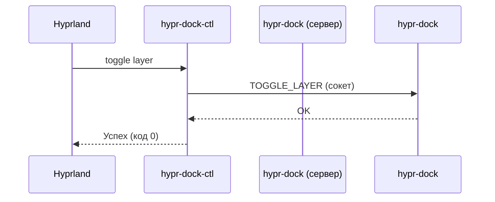

### **Техническое задание: Реализация `hypr-dock-ctl` для управления hypr-dock**  

#### **1. Цель**  
Создать **отдельный CLI-бинарник** `hypr-dock-ctl` для управления доком через IPC, обеспечив:  
- **Смену режима слоя** (`auto` ↔ `exclusive`) без перезапуска дока.  
- **Единообразие с `hyprctl`** (синтаксис, флаги, вывод).  
- **Масштабируемость** для будущих команд (темы, настройки, статус).  

---

### **2. Требования**  

#### **2.1. Базовый функционал (v1.0)**  
- **Команда `toggle`**  
  ```bash
  hypr-dock-ctl toggle layer  # Переключает между auto и exclusive
  ```  
  - Отправляет команду через **Unix-socket** (`/tmp/hypr-dock.sock`).  
  - Если док **не запущен** — игнорирует команду (или выводит ошибку).  

- **Команда `get`**  
  ```bash
  hypr-dock-ctl get layer     # Выводит текущий режим (auto/exclusive)
  ```  
  - Возвращает текст или JSON (если `--json`).  

- **Интеграция с Hyprland**  
  ```bash
  bind = SuperShift, D, exec, hypr-dock-ctl toggle layer
  ```  

#### **2.2. Дополнительные требования**  
- **Единый стиль с `hyprctl`**:  
  - Поддержка флагов `--json`, `--help`.  
  - Чёткие сообщения об ошибках (например, `Dock is not running`).  
- **Только один инстанс дока**:  
  - При запуске `hypr-dock` проверяется, что сокет свободен.  

---

### **3. Концепция реализации**  

#### **3.1. IPC-протокол**  
- **Формат команд**: Текстовые строки (для простоты).  
  ```text
  TOGGLE_LAYER
  GET_LAYER
  ```  
- **Ответы**:  
  - `OK` — успех.  
  - `ERROR: Not running` — док не активен.  
  - `auto`/`exclusive` — для `get`.  

#### **3.2. Схема взаимодействия**  


#### **3.3. Обработка ошибок**  
| Ситуация                  | Действие                          |
|---------------------------|-----------------------------------|
| Док не запущен            | `ERROR: Dock is not running`      |
| Неверная команда          | `ERROR: Unknown command`          |
| Сокет занят/недоступен    | `ERROR: Cannot connect to dock`   |

---

### **4. Возможные расширения (будущие версии)**  

#### **4.1. Управление темами**  
```bash
hypr-dock-ctl set theme dark
hypr-dock-ctl get theme
```  

#### **4.2. Динамические настройки**  
```bash
hypr-dock-ctl set margin 10
hypr-dock-ctl set spacing 5
```  

#### **4.3. Статус и отладка**  
```bash
hypr-dock-ctl status  # Вывод всех параметров (JSON)
hypr-dock-ctl reload  # Перезагрузка конфига
```  

#### **4.4. Интеграция с `hyprctl`**  
В будущем — добавление подкоманд в `hyprctl`:  
```bash
hyprctl dock toggle layer
hyprctl dock get theme
```  

---
### **5. Этапы реализации**  
1. **Реализация IPC-сервера** в `hypr-dock` (обработка команд).  
2. **Создание `hypr-dock-ctl`** с командами `toggle` и `get`.  
3. **Тестирование**:  
   - Запуск/остановка дока.  
   - Конкуренция за сокет.  
4. **Документация**:  
   - `man hypr-dock-ctl`.  
   - Примеры для `hyprland.conf`.  