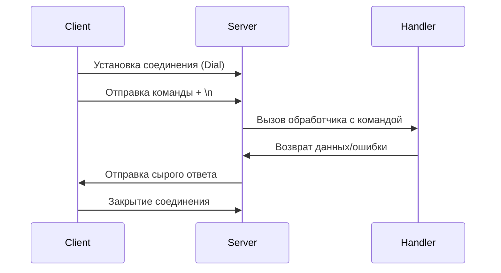

# **Проектная документация модуля dockIPC**

## **1. Концепция модуля**

### **1.1 Назначение**
Модуль `dockIPC` предоставляет минималистичный API для организации межпроцессного взаимодействия (IPC) через Unix domain sockets. Основные цели:
- Создание стабильного канала коммуникации между демоном и клиентами
- Поддержка синхронного запрос-ответ взаимодействия
- Обеспечение простой интеграции без сложных зависимостей

### **1.2 Ключевые принципы**
1. **Минимализм** - только базовые функции для IPC
2. **Идемпотентность** - повторные вызовы дают одинаковый результат
3. **Атомарность** - каждая операция либо завершается полностью, либо не выполняется
4. **Потокобезопасность** - корректная работа в многопоточной среде

---

## **2. Архитектурные компоненты**

### **2.1 Серверная часть**
#### **Алгоритм работы:**
1. **Инициализация сокета**
   - Удаление существующего файла сокета (атомарная операция)
   - Создание нового Unix domain socket
   - Установка прав доступа (0666)

2. **Цикл обработки соединений**
   - Принятие входящего соединения (блокирующая операция)
   - Запуск обработчика соединения в отдельной goroutine
   - Чтение команды из сокета (максимальный размер - 4КБ)
   - Вызов пользовательского обработчика
   - Отправка результата обратно клиенту

3. **Обработка ошибок**
   - Автоматическое закрытие соединений при ошибках
   - Преобразование ошибок обработчика в стандартный формат

### **2.2 Клиентская часть**
#### **Алгоритм работы:**
1. **Установка соединения**
   - Попытка подключения к существующему сокету
   - Таймаут по умолчанию (системный)

2. **Передача команды**
   - Запись строки команды в сокет
   - Добавление терминатора `\n` для четкого разделения команд

3. **Получение ответа**
   - Чтение данных из сокета (блокирующая операция)
   - Возврат сырых бинарных данных

---

## **3. Взаимодействие компонентов**

### **3.1 Особенности взаимодействия**
1. **Синхронная модель** - клиент блокируется до получения ответа
2. **Статический буфер** - фиксированный размер 4КБ для простоты
3. **Гарантия доставки** - либо полный ответ, либо ошибка

---

## **4. Алгоритмы обработки**

### **4.1 Обработка соединений (Server)**
1. **Мультиплексирование**:
   - Каждое соединение обрабатывается в отдельной goroutine
   - Нет ограничения на количество одновременных соединений

2. **Управление ресурсами**:
   - Деферы для гарантированного закрытия соединений
   - Автоматическое восстановление после ошибок

3. **Формат обмена**:
   - Команды - строки в UTF-8
   - Ответы - произвольные бинарные данные

### **4.2 Обработка ошибок**
1. **Типы ошибок**:
   - Ошибки соединения (файл сокета не существует)
   - Ошибки чтения/записи
   - Ошибки пользовательского обработчика

2. **Стратегии**:
   - Автоматическое повторное создание сокета
   - Преобразование ошибок в стандартный формат
   - Гарантированное освобождение ресурсов

---

## **5. Концепция реализации**

### **5.1 Сервер**
**Ключевые идеи:**
1. **Один сокет - много соединений**:
   - Основной цикл принимает соединения
   - Каждое соединение - отдельный экземпляр обработчика

2. **Изоляция состояний**:
   - Нет разделяемого состояния между обработчиками
   - Все зависимости инжектятся через замыкания

3. **Гибкость обработки**:
   - Пользовательский обработчик может реализовывать любую логику
   - Поддержка как текстовых, так и бинарных протоколов

### **5.2 Клиент**
**Ключевые идеи:**
1. **Простота использования**:
   - Одна функция для отправки команд
   - Прозрачное управление соединением

2. **Детерминированность**:
   - Четкое разделение команд через `\n`
   - Предсказуемый размер буфера

3. **Расширяемость**:
   - Возможность добавления таймаутов
   - Поддержка разных стратегий сериализации

---

## **6. Ограничения и допущения**

1. **Размер сообщений**:
   - Максимальный размер - 4КБ (можно увеличить при необходимости)
   - Нет поддержки потоковой передачи

2. **Безопасность**:
   - Нет шифрования передаваемых данных
   - Аутентификация через права файловой системы

3. **Производительность**:
   - Оптимизировано для low-throughput коммуникации
   - Не подходит для high-frequency RPC

---

## **7. Перспективы развития**

1. **Добавление**:
   - Таймаутов соединения
   - Поддержки потоковой передачи
   - Механизма аутентификации

2. **Оптимизация**:
   - Пула соединений
   - Буферизированного ввода/вывода
   - Более эффективного аллокатора памяти

Модуль специально спроектирован для постепенного расширения функциональности при сохранении базовых принципов простоты и надежности.